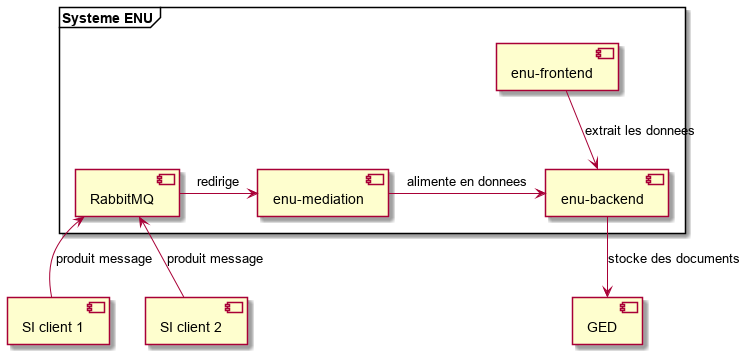

# L'espace numérique de l'usager à Genève

Ce projet fournit une documentation sur le projet "Espace numérique de l'usager" tel qu'il a été
configuré à Genève.

## Présentation fonctionnelle

(à faire)

## Présentation technique

Le système se compose de 4 composants principaux, résumés dans le tableau suivant :

| Composant | Responsabilités | Technologies | 
| --------- |:--------------- | ------------ |
| enu-frontend | interface homme-machine | HTML 5, React, JavaScript | 
| enu-backend   | stockage des données et accès via REST | Java, Spring, PostgreSQL |
| enu-mediation | transformation et routage des messages | Java, Apache Camel |
| RabbitMQ | middleware de messagerie | Apache RabbitMQ | 

Le diagramme ci-dessus est en réalité simplifié : si le SI client est principalement producteur de messages et
enu-mediation, principalement consommateur, pour certaines données le trafic s'opère dans l'autre sens.

### enu-frontend

REST

### enu-backend

Ce composant est le coeur du système. Il est constitué principalement de bibliothèques de FormServices, qui est
le serveur d'exécution de la solution [FormSolution](https://www.jway.eu/) de formulaires en ligne de l'éditeur Jway.
On notera que l'État de Genève exploite deux spécimens de FormServices : l'un est FormSolution, qui est payant,
qui héberge les formulaires en ligne de l'administration cantonale ; l'autre est intégré, en mode open source, dans
l'Espace nunérique de l'usager décrit ici.

BD shcéams de Jway

### enu-mediation

Une solution de messagerie a été incluse dans le système. Elle permet de découpler les systèmes métier de
enu-backend.
Le découplage est d'une part fonctionnel. Les contrats des messages ont été définis de manière à reproduire
le besoin fonctionnel convenu entre les analystes de l'Espace numérique et les responsables des divers systèmes
métier. Le composant enu-mediation transforme donc les données du format métier vers le format imposé par la 
solution FormServices.
Le découplage est d'autre part technique. Il permet d'exécuter les opérations de façon asynchrone. Il constitue
ainsi un tampon, présumé plus robuste que n'importe quel autre composant de la chaîne, et permet que n'importe
quel composant - par exemple, enu-backend ou un système métier - demeure un temps inaccessible.

Techniquement, enu-mediation est une application Spring Boot exploitant intensivement
[Apache Camel](https://camel.apache.org). Elle reçoit ses messages de RabbitMQ, les transforme et les route
vers un ou plusieurs services REST de enu-backend. Un message contient par exemple les données d'une nouvelle
démarche d'un usager.
Le flux se fait parfois dans le sens inverse, par exemple quand sur l'IHM enu-frontend l'usager ... ; le système
métier doit en être averti.

### RabbitMQ

[Apache RabbitMQ](https://www.rabbitmq.com) est une mise en oeuvre reconnue et open source du protocole de
messagerie [AMQP](https://en.wikipedia.org/wiki/Advanced_Message_Queuing_Protocol).

Queues

En cas d'erreur, rejouer

Il a été dans un premier temps envisagé l'utiliser [Apache Kafka](http://kafka.apache.org/) plutôt que RabbitMQ
comme solution de messagerie.
Une étude de faisabilité poussée a montré que la puissance de Kafka, notamment sa capacité de mise à l'échelle
horizontale et de traitements massifs de données, allait au-delà des besoins de l'Espace numérique de l'usager
et ne compensait pas sa complexité ; de plus, certains éléments importants (intégration LDAP, console d'administration)
n'entraient pas dans une solution entièrement open source.
De son côté, RabbitMQ remplit assez exactement le besoin de l'Espace numérique de l'usager.

### Autres

#### SI client

Un SI (système informatique) client est un système de l'État, par exemple le système de l'Administration fiscale
ou celui de l'Office des poursuites et faillites ou celui des Formulaires en ligne.

#### Valve

#### Charte graphique

## Présentation organisationnelle

Le projet Espace numérique de l'usager est une collaboration entre l'État de Genève (c'est-à-dire le canton de 
Genève, en Suisse) et la société luxembourgeoise [Jway](https://jway.eu).

à faire :
- but de chacun
- part de chacun à la construction
- part de chacun à la gouvernance open source
