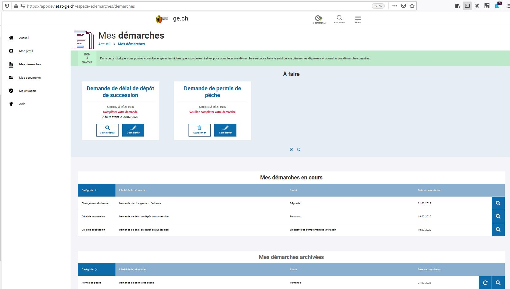
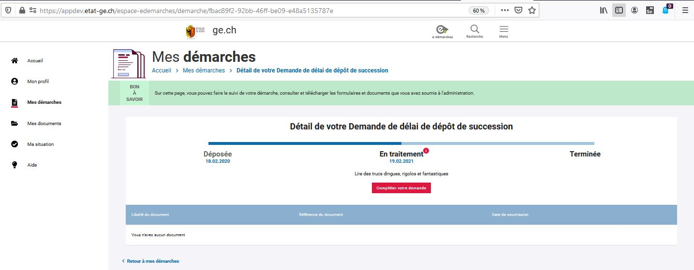
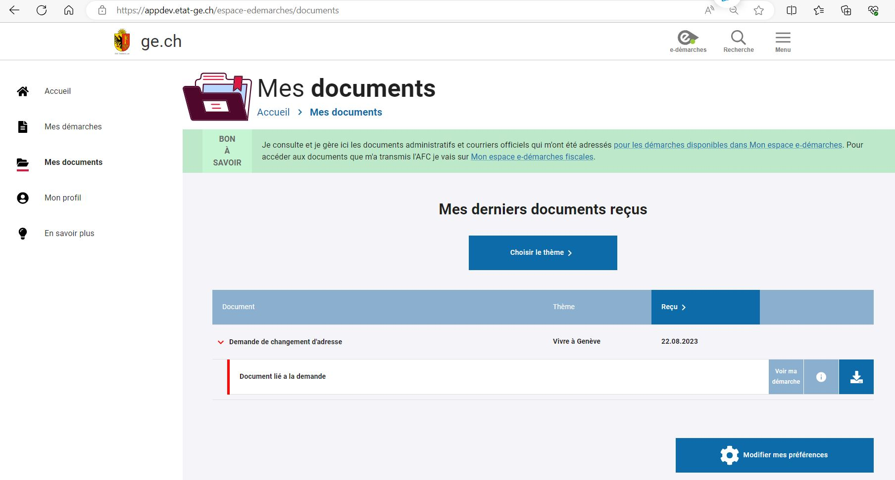
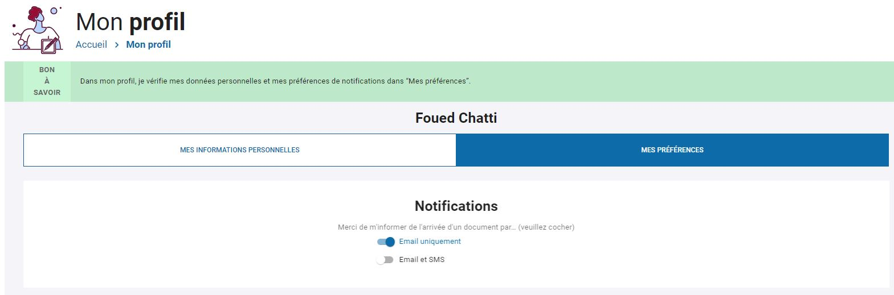
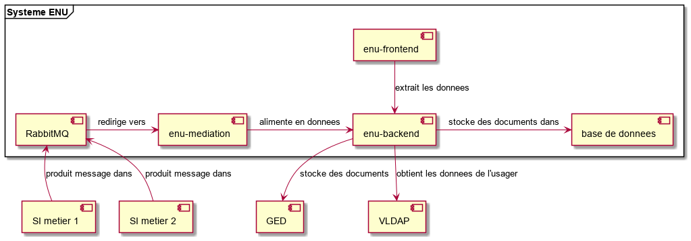

# L'espace numérique de l'usager à Genève

Ce projet fournit une documentation sur le projet "Espace numérique de l'usager" tel qu'il a été
configuré à Genève.

## Présentation fonctionnelle

L'Espace numérique de l'usager est une application Web visant à munir le citoyen genevois d'une vue de l'ensemble
de ses démarches auprès de l'État de Genève, alors qu'actuellement cette vue est éparpillée parmi les systèmes 
des divers offices de l'État.
Comme exemples de démarches, on peut citer la soumission de la déclaration d'impôts, la demande d'un certificat
de bonne vie et mœurs, l'inscription au chômage, la requête en autorisation d'une manifestation.
Les principales fonctionnalités du système sont :
- présenter les démarches engagées par l'usager et leur suivi par l'administration ;
- présenter les actions de l'usager attendues par l'administration ;
- présenter les documents administratifs envoyés par l'administration à l'usager.

On notera que l'Espace numérique ne contient aucune fonctionnalité de création de démarche - par exemple via
une saisie dans un formulaire. Toutes les démarches sont créées extérieurement, dans les divers systèmes des
offices de l'État ; l'Espace numérique de l'usager ne fait que les agréger.

Voici la page d'accueil de l'usager :

Si l'usager clique sur &#x00AB;&#x00A0;Mes démarches&#x00A0;&#x00BB;, la page suivante s'ouvre :

Cette page présente les tâches attendues de l'usager, ses démarches en cours et ses démarches
achevées. 
Cliquer sur la loupe d'une ligne d'une démarche donne le détail de la démarche :

Une démarche peut passer par trois états successifs :
&#x00AB;&#x00A0;déposée&#x00A0;&#x00BB;,
&#x00AB;&#x00A0;en traitement&#x00A0;&#x00BB; et
&#x00AB;&#x00A0;terminée&#x00A0;&#x00BB;.

La seconde principale fonctionnalité, après &#x00AB;&#x00A0;Mes démarches&#x00A0;&#x00BB;, est
&#x00AB;&#x00A0;Mes documents&#x00A0;&#x00BB; :

Cet écran reprend la liste des documents envoyés à l'usager par l'administration.
Un document peut être un récapitulatif d'une démarche
(par exemple, le document &#x00AB;&#x00A0;Accusé de réception&#x00A0;&#x00BB;),
ou bien un élément d'une lettre adressée à l'usager ; par exemple, la lettre du 09.04.2021
contient trois documents portant sur une démarche de changement d'adresse.

Les documents liés à une démarche sont également présents dans l'écran de détail de la démarche.

Une autre fonctionnalité est
&#x00AB;&#x00A0;Mon profil&#x00A0;&#x00BB; :

Dans celle-ci, l'usager peut préciser ses préférences de notifications lors de ses interactions avec l'administration : par courriel ou par SMS.

La fonctionnalité
&#x00AB;&#x00A0;Ma situation&#x00A0;&#x00BB;,
non encore développée, présentera à l'usager sa situation vis-à-vis de l'administration fiscale. 

## Présentation technique

Le système se compose de 4 composants principaux, résumés dans le tableau suivant :

| Composant | Responsabilités | Technologies | Maintenu par |
| --------- |:--------------- | ------------ | ------------ |
| enu-frontend | interface homme-machine | HTML 5, React, JavaScript, WebSocket | Jway |
| enu-backend | stockage des données et accès via REST | Java, Spring, PostgreSQL | Jway |
| enu-mediation | transformation et routage des messages | Java, Spring Boot | État de Genève |
| RabbitMQ | middleware de messagerie | RabbitMQ | VMWare Tanzu |

Le diagramme ci-dessus est en réalité simplifié : si le SI client est principalement producteur de messages et
enu-mediation, principalement consommateur, pour certaines données le trafic s'opère dans l'autre sens.

### a) enu-frontend

Ce composant définit l'interface présentée à l'usager.

Les fonctionnalités sont peu nombreuses et consistent essentiellement en de l'affichage de données.
Comme il n'y a pas d'opérations complexes, comme des saisies de données avec validations ou des gestions d'états
de composants graphiques, l'économie a pu être faite de l'usage d'un canevas d'application avancé comme Angular.
Au contraire, l'interface se base sur le standard HTML 5, avec support de la bibliothèque React et d'une quantité
modérée de code en JavaScript.

Pour l'affichage en temps quasi réel de nouvelles démarches, les WebsSockets sont néanmoins utilisés. 

La communication se fait uniquement avec le composant enu-backend, au moyen d'appels de services REST.

Ce composant utilise la charte graphique de l'État de Genève (lien ici).
Comme cette charte est externe, elle est aisément remplaçable par la charte d'une autre organisation.

### b) enu-backend

Ce composant est le coeur du système. Il est constitué principalement de bibliothèques de FormServices, qui est
le serveur d'exécution de la solution [FormSolution](https://www.jway.eu/) de formulaires en ligne de l'éditeur Jway.
On notera que l'État de Genève exploite deux spécimens de FormServices : l'un est FormSolution, qui est payant et
qui héberge la plupart de formulaires en ligne de l'administration cantonale ;
l'autre est intégré, en mode open source, dans l'Espace numérique de l'usager décrit ici.

Ce composant contrôle une base de données PostgreSQL, dont le schéma de données est pour l'essentiel celui de
FormServices.

Ce composant est écrit en Java et est basé sur JPA, Spring et JAX-RS. 

Une refont de ce module est en cours pour le rendre modulaire. Le framework Jway sera supprimé et la base de donnée PostgreSQL
sera remplacée par MongoDB.

### c) enu-mediation

Une solution de messagerie a été incluse dans le système. Elle permet de découpler les systèmes métier de
enu-backend.
Le découplage est d'une part fonctionnel. Les contrats des messages ont été définis de manière à reproduire
le besoin fonctionnel convenu entre les analystes de l'Espace numérique et les responsables des divers systèmes
métier. Le composant enu-mediation transforme donc les données du format métier vers le format imposé par la 
solution FormServices.
Le découplage est d'autre part technique. Il permet d'exécuter les opérations de façon asynchrone. Il constitue
ainsi un tampon, présumé plus robuste que n'importe quel autre composant de la chaîne, et permet que n'importe
quel composant - par exemple, enu-backend ou un système métier - demeure un temps inaccessible.

Techniquement, enu-mediation est une application Spring Boot.
Elle reçoit ses messages de RabbitMQ, les transforme et les route
vers un ou plusieurs services REST de enu-backend. Un message contient par exemple les données d'une nouvelle
démarche d'un usager.
Le flux se fait parfois dans le sens inverse, par exemple quand sur l'IHM enu-frontend l'usager ... ; le système
métier doit en être averti.

### d) RabbitMQ

[RabbitMQ](https://www.rabbitmq.com) est une mise en oeuvre reconnue et open source du protocole de
messagerie [AMQP](https://en.wikipedia.org/wiki/Advanced_Message_Queuing_Protocol).

L'application Espace numérique utilise RabbitMQ en y définissant des queues et des "Exchanges".

(à faire : queues de réponse, queues d'erreur, trafic bi-directionnel)

Il a été dans un premier temps envisagé l'utiliser [Apache Kafka](http://kafka.apache.org/) plutôt que RabbitMQ
comme solution de messagerie.
Une étude de faisabilité poussée a montré que la puissance de Kafka, notamment sa capacité de mise à l'échelle
horizontale et de traitements massifs de données, allait au-delà des besoins de l'Espace numérique de l'usager
et ne compensait pas sa complexité ; de plus, certains éléments importants (intégration LDAP, console d'administration)
n'entraient pas dans une solution entièrement open source.
De son côté, RabbitMQ remplit assez exactement le besoin de l'Espace numérique de l'usager.

### e) Autres

#### SI métier

Un SI (système informatique) client est un système de l'État, par exemple le système de l'Administration fiscale,
celui de l'Office des poursuites et faillites ou celui des Formulaires en ligne.
Le SI métier est le pourvoyeur d'informations à l'Espace numérique. Ces informations consistent principalement
dans les démarches ouvertes par les usagers dans le SI client, ainsi que les documents afférents.
Une démarche envoyée par un SI métier est donc stockée en deux endroits : dans la base de données du SI
métier et dans la base de données de l'Espace numérique.

#### Valve et VLDAP

Le composant enu-backed est déployé sur un serveur Tomcat, sur lequel une valve Tomcat est déployée.
Cette valve interroge un VLDAP de l'État pour rapatrier les rôles de l'usager et les transmettre au
composant enu-backend. Les rôles des usagers sont ainsi synchronisés entre l'annuaire de l'État et l'Espace
numérique.

L'authentification de l'usager se fait en amont et est contrôlée par le proxy inverse de l'État de Genève.

#### Charte graphique

(à faire)

## Présentation organisationnelle

Le projet Espace numérique de l'usager est une collaboration entre l'État de Genève 
et la société luxembourgeoise [Jway](https://jway.eu).
Cette collaboration permet aux deux parties de diffuser leurs savoir-faire respectifs.

Comme il a été expliqué plus haut, le coeur de l'Espace numérique est le serveur FormServices de la solution
de formulaires en ligne proposée par la société Jway, et entièrement développé par elle depuis des années.
Les composants enu-frontend, enu-mediation et enu-backend ont été développés par l'État de Genève - le composant
enu-backend en étroite collaboration avec Jway.

La maintenance de l'Espace numérique de l'usager tel qu'il est déployé à Genève est assurée par l'État de Genève.
